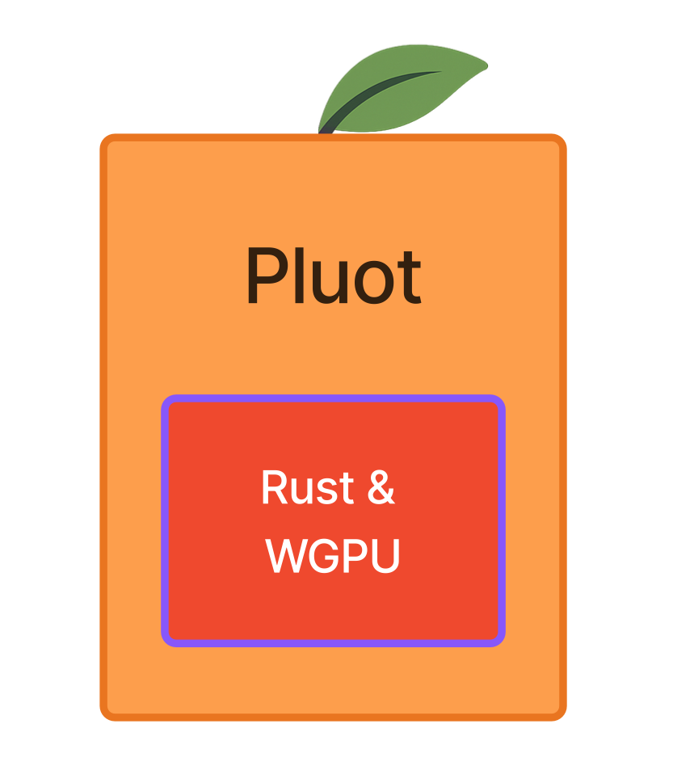

# pluot

<a href="#"></a>

Goal: Implement a custom data visualization once, then render it everywhere\* (across languages, static or interactive, raster or vector).

How it works: "headless" plotting. Pluot uses Rust and [WGPU](https://github.com/gfx-rs/wgpu) to render plots to an array of pixels (or an SVG string), decoupled from any windowing system:
- Render static plots via Rust directly (no web browser needed)
- Render static plots via Python (no web browser needed)
- Render static plots via JavaScript
- Render interactive plots via JavaScript
- Raster/bitmap and vector (SVG) output supported

_In other words: "rewrite it in rust," but for plotting._

\* "everywhere" currently means Rust, Python, and JavaScript (including in a web browser). Further bindings remain future work.


## Features

- __Fast__: Each `render()` call (at least for the case of raster-based rendering) should be efficient/quick enough for calling on each frame of an animation or user interaction (e.g., pan, zoom, hover).
- __Small__: The bundle size (i.e., the WASM binary size) should be kept small (currently ~2MB) to make it practical to use in web applications.
- __Scalable__: Scales to out-of-memory dataset sizes using partial reads of arrays/columns and data tiling/aggregation strategies (currently using Zarr to achieve this).
- __Raster or Vector Outputs__: Plotting functions can implement both raster and vector equivalents, to support publication-quality graphics export.
- __Developer Experience Considerations__: Provides D3-like utilities (scales, axes, etc.) and a declarative layer-based API to enable the development of customized plot types (See https://github.com/keller-mark/pluot/issues/105 for more details).

## How it works

Plotting functions are implemented in Rust using the Rust WGPU implementation of WebGPU (Note: WGPU can be used as a standalone WebGPU renderer, decoupled from any web browser).
These Rust plotting functions are only concerned with producing a "static" plot output, given their input parameters and data.

- To render plots in the web browser, the Rust code is compiled to WebAssembly (WASM).
  - JavaScript wrapper code handles interactivity and data-loader registration.
  - The Rust code calls pre-registered data-loading functions when it needs to retrieve (subsets of) data (via Zarr).
- To render static plots in a Python context, Rust bindings generated by PyO3/maturin can be used.
  - Simple Python wrapper functions convert the returned pixel buffers into NumPy arrays or PNG/JPG/etc images.
  <!-- - To render interactive plots in Python, AnyWidget can be used (Not yet implemented) -->

### Why not just use JS+WebGPU directly?

This would couple the plotting code to JS, which we do not want for a library that should be usable in multiple languages, including without a JS runtime.
Our approach enables our CPU-based operations to benefit from the performance characteristics of Rust (or, in web contexts, at least those of Rust-via-WASM).

Read more about the project's motivations in my [blog post](https://github.com/keller-mark/blog/blob/main/2026-01-12-pluot-motivations.md).

### Non-goals

<!-- - Heavy customization of plots via the client/JS API. For example, defining shader fragments from JS. -->
<!-- - WebGL fallbacks. Instead, we can be patient and wait until WebGPU availability improves. -->
- Window/Canvas management via Rust. This should be handled by the parent/calling code. The Rust code should be concerned with returning the rendered bytes, which can be written to HTML Canvas or saved to a file by the calling library. This both reduces the scope and decouples the plotting from any particular GUI framework.
- Coordinated multiple views. This can be achieved via the parent/calling library, for example, by wrapping with [use-coordination](https://github.com/keller-mark/use-coordination) or your favorite state management library.

## Development

Further developer documentation can be found in [dev-docs](./dev-docs/README.md).

## Set up environment

Install Rust tools with [Rustup](https://rustup.rs/).

```sh
# Install rustup
cargo install wasm-pack
cargo build

# Install pnpm
# may need to run `wasm-pack build --target web` first
pnpm install

# Install uv

# Generate/download sample data
# See data/README.md

uv sync --extra dev
```

### Build for WASM

```sh
# Install nightly version of wasm-bindgen CLI (potentially not needed anymore)
# Reference: https://github.com/wasm-bindgen/wasm-bindgen/issues/4446#issuecomment-3172624621
cargo install --git https://github.com/rustwasm/wasm-bindgen --rev b766ac3e206a8efab2c7cf91923cd502b2bc77a5 wasm-bindgen-cli


wasm-pack build --target web
# or
wasm-pack build --target web && pnpm run start
# or
wasm-pack build --dev --target web && pnpm run start
# or
wasm-pack build --release --target web && pnpm run start
```


Test in browser:

```sh
http-server --cors="*" -p 3005 .
```

Open to http://localhost:3005/www/

### Test in Headless Browsers with `wasm-pack test`

```sh
wasm-pack test --headless --chrome
```

### Publish to NPM with `wasm-pack publish`

```sh
wasm-pack publish
```

### Build for Python

```sh
uv sync --extra dev
```

Build:

```sh
uv run maturin develop --features python
```

Run tests:

```sh
uv run pytest
```

Use in REPL:

```sh
uv run python -m asyncio
>>> from pluot import render_py
>>> await render_py(width=100, height=100, plotId="test", plotType="triangle", storeName="test")
```

Try in Jupyter notebook:

```sh
uv run jupyter lab --notebook-dir python-notebooks
```

Try in Marimo notebook:

```sh
uv run marimo edit
```

### Build for plain Rust

```sh
cargo build
```

Run tests:

```sh
cargo test --features test_plain_rust
```

## Inspired by

This work has been informed by my experiences in contributing to the following projects:

- https://github.com/vitessce/vitessce
- https://github.com/keller-mark/use-coordination
- https://github.com/hms-dbmi/viv
- https://github.com/hms-dbmi/cistrome-explorer
- https://github.com/keller-mark/deck-to-svg
- https://github.com/higlass/higlass
- https://github.com/keller-mark/vueplotlib
- https://github.com/vitessce/easy_vitessce

and has also been inspired by the following projects:

- https://github.com/visgl/deck.gl
- https://github.com/UnfoldedInc/deck.gl-native
- https://github.com/observablehq/plot
- https://github.com/flekschas/jupyter-scatter
- https://github.com/gosling-lang/gosling.js
- https://github.com/scverse/napari-spatialdata
- https://github.com/scverse/spatialdata-plot
- https://github.com/scverse/scanpy

## Related work

See [awesome-rust-vis](https://github.com/keller-mark/awesome-rust-vis) for a list of crates related to data visualization and plotting.

## About the name

- A [pluot](https://en.wikipedia.org/wiki/Pluot) is a fruit that is a hybrid of a plum and an apricot. The fruit's pit is to its flesh as the Rust core of this crate is to its other programming language bindings.
- "Plot" with an extra "u" (from R<strong>u</strong>st)
