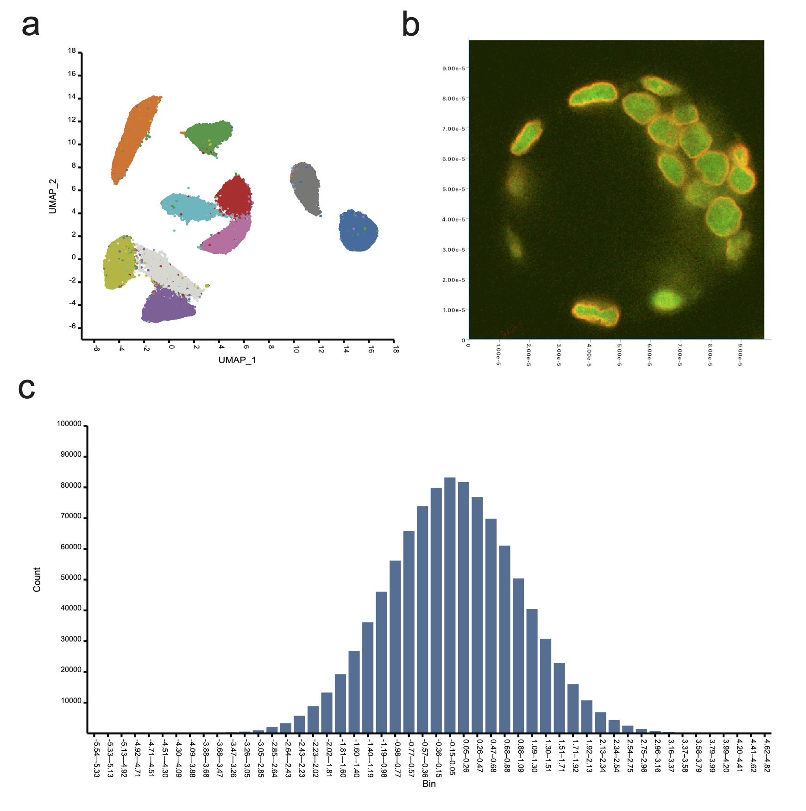
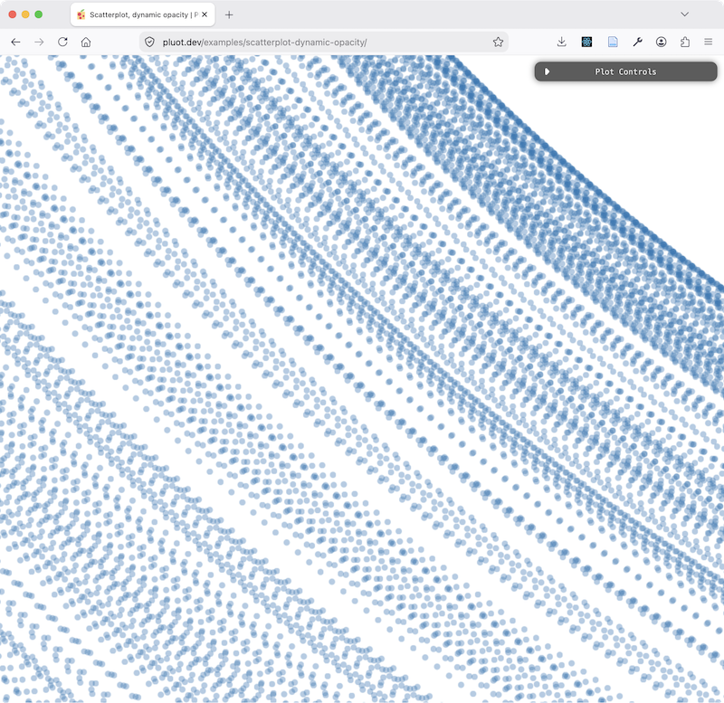
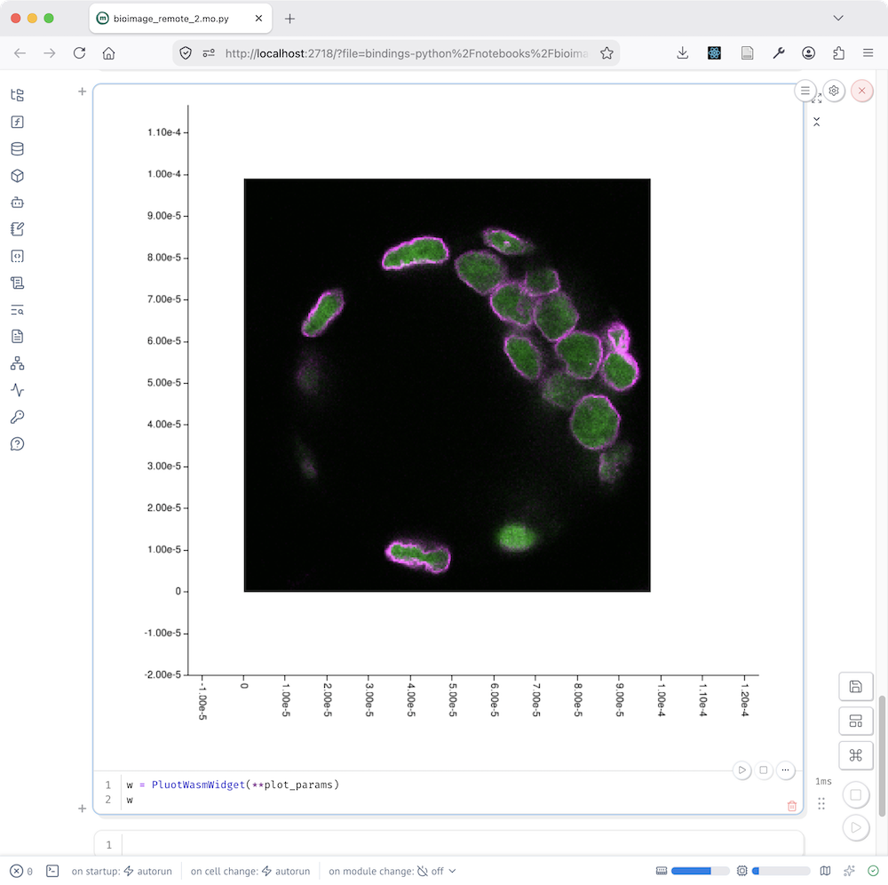
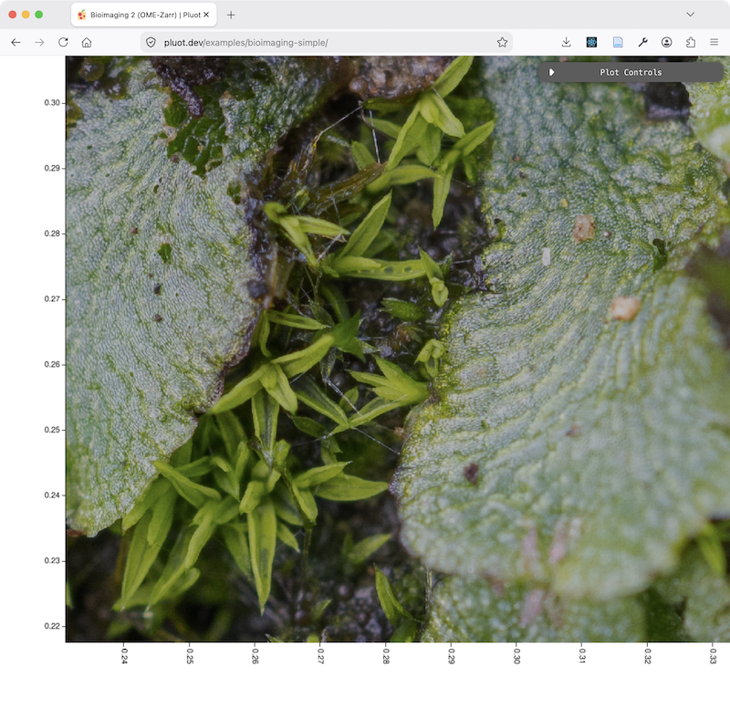
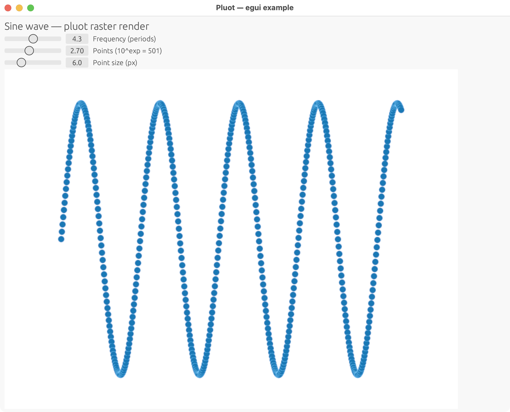
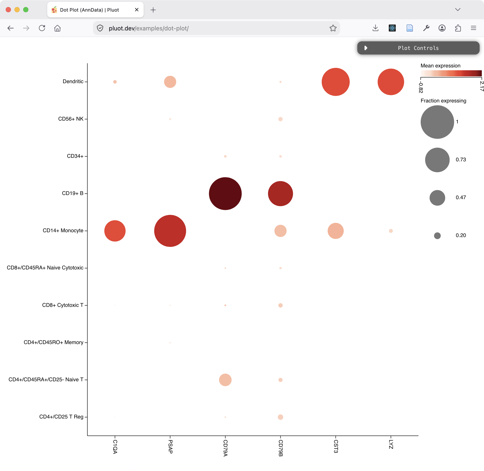

# pluot

<a href="https://commons.wikimedia.org/wiki/File:Red_pluots.JPG"></a>


[blog post](https://markk.co/blog/2026-04-24-pluot-motivations) &nbsp;✦&nbsp; [docs](https://pluot.dev) &nbsp;✦&nbsp; [example](https://pluot.dev/examples/bioimaging/) &nbsp;✦&nbsp; [crate](https://crates.io/crates/pluot) &nbsp;✦&nbsp; [pypi](https://pypi.org/project/pluot/) &nbsp;✦&nbsp; [npm](https://www.npmjs.com/package/@pluot/react) &nbsp;✦&nbsp; [paper](https://doi.org/10.48550/arXiv.2605.14118)


Implement a data visualization once, then render it in multiple contexts (across languages, static or interactive, bitmap or vector).

Rust, Python, R, and JavaScript (including in a web browser) are currently supported.


:test_tube: Pluot is new and experimental.


## Features
<!-- - __Fast__: Each `render()` call (at least for the case of raster-based rendering) should be efficient/quick enough for calling on each frame of an animation or user interaction (e.g., pan, zoom, hover).-->
- __Small__: The bundle size (i.e., the WASM binary size) is small (currently less than 5MB) to make it feasible to integrate into web applications.
- __Scalable__: Scales to out-of-memory dataset sizes using partial reads of arrays/columns and data tiling/aggregation strategies (currently using Zarr via [zarrs](https://github.com/zarrs/zarrs) to achieve this).
- __Language bindings__: Usable from multiple languages, including JavaScript/TypeScript (via WASM), Python (via PyO3/maturin bindings), and R (via extendr bindings).
- __Bitmap or Vector Outputs__: Plotting functions can implement bitmap and vector equivalent drawing logic, to support publication-quality graphics export.
- __Layer-based API__: Compose the built-in layers to create complex plots, or build your own layers with full control over the WebGPU shaders, buffers, and draw calls. Usage of WebGPU compute (GPGPU) operations prior to each layer's draw call is also supported (regardless of whether bitmap or vector output format).


⚠️ Currently focusing on 2D, before eventually supporting polar, ternary, and [3D](https://pluot.dev/examples/scatterplot-3d/).

## Examples

|  |  |  |
| :---: | :---: | :---: |
| **Static or interactive plots**<br><sub>Bitmap or vector graphics</sub><br><br> | **Web-based plots**<br><sub>Scalable to millions of points</sub><br><br><br><br>[Open example](https://pluot.dev/examples/scatterplot-dynamic-opacity/) | **Python notebooks**<br><sub>Render static plots or use Jupyter widget built with Anywidget</sub><br><br><br><br>[View source](./bindings-python/notebooks) |
| **React component**<br><sub>Use React or plain JS</sub><br><br><br><br>[Open example](https://pluot.dev/examples/bioimaging-simple/) | **Rust-based GUIs**<br><sub>Examples with Slint and Egui; Framework-agnostic</sub><br><br><br><br>[View source](./examples) | **Scientific data formats**<br><sub>Support for OME-Zarr and AnnData</sub><br><br><br><br>[Open example](https://pluot.dev/examples/dot-plot/) |


## How it works

Pluot uses Rust :crab: and WebGPU via [wgpu](https://github.com/gfx-rs/wgpu) to quickly render plots to an array of pixels (or an SVG string), decoupled from any windowing system or interpreted language runtime. On each "frame" of an interaction or animation, we re-render with updated plotting parameters.


When the language bindings are used, you can think of this as a form of "remote rendering", which is actually happening locally; rather than the "remote" being a far-away server, it is just across the language binding boundary.


### Why would I want to use this? Why not just use JS+WebGPU directly?

The main reasons are:
- **Portability**: render plots from multiple languages, without the overhead of an interpreted programming language runtime
- **Reproducibility**: explore data using an interactive tool (e.g., web or desktop GUI) to identify plotting parameters of interest, and then use the same parameter values in a scripting language to reproduce the visualization as a static plot (e.g., a Python script in a Snakemake pipeline)

Using WebGPU via JavaScript would couple things to JavaScript, which we do not want for a library that should be usable in multiple languages, including without a JS runtime.
Our approach enables our CPU-based operations to benefit from the performance characteristics of Rust (or, in web contexts, at least those of Rust-via-WASM).

You can likely achieve better performance by using WebGPU directly via JavaScript.
The question is whether the performance of this Rust-based approach is good enough, and whether the benefits are worth the potential performance tradeoffs for your use case.


## Development

Further developer documentation, including troubleshooting tips, can be found in [dev-docs](./dev-docs/README.md).

## Set up environment

After cloning the repository, pull down the submodule containing font files.

```sh
git submodule update --init --recursive
cd bindings-js/core && pnpm run copy-fonts && cd -
```

Install Rust tools with [Rustup](https://rustup.rs/).

```sh
# Install rustup
cargo install wasm-pack
cargo install cargo-edit
cargo build

# Install pnpm
# may need to run `wasm-pack build crates/pluot --target web` first
pnpm install

# Install uv

# Generate/download sample data
# See data/README.md

uv sync --extra dev
```

### Build for WASM

```sh
# Install nightly version of wasm-bindgen CLI (potentially not needed anymore)
# Reference: https://github.com/wasm-bindgen/wasm-bindgen/issues/4446#issuecomment-3172624621
cargo install --git https://github.com/rustwasm/wasm-bindgen --rev b766ac3e206a8efab2c7cf91923cd502b2bc77a5 wasm-bindgen-cli

wasm-pack build crates/pluot --target web && pnpm run start-demo
# or
wasm-pack build crates/pluot --dev --target web && pnpm run start-demo
# or
wasm-pack build crates/pluot --release --target web && pnpm run start-demo

```

<!--

Test in browser:

```sh
http-server --cors="*" -p 3005 .
```

Open to http://localhost:3005/www/

-->

### Test in Headless Browsers with `wasm-pack test`

```sh
wasm-pack test --headless --chrome crates/pluot
# or
wasm-pack test --headless --chrome crates/pluot -- --nocapture
# or
wasm-pack test --chrome crates/pluot
# or
wasm-pack test --firefox crates/pluot
```

<!-- TODO: update and un-comment once publishing details are established

### Publish to NPM with `wasm-pack publish`

```sh
wasm-pack publish
```

-->

### Build for Python

```sh
uv sync --extra dev --extra widget
```

Build:

```sh
uv run maturin develop --features python
```

Run tests:

```sh
uv run pytest
```

Use in REPL:

```sh
uv run python -m asyncio
>>> from pluot import render_py
>>> await render_py(width=100, height=100, plotId="test", plotType="triangle", storeName="test")
```

Try in Marimo notebook:

```sh
uv run marimo edit
```

Try in Jupyter notebook:

```sh
uv run jupyter lab --notebook-dir bindings-python/notebooks
```


### Build for plain Rust

```sh
cargo build
```

### Run tests

```sh
cargo test
# or
cargo test --features lacks_gpu
# or, run a specific test file
cargo test -p pluot_core --test test_positioning
```

### Lint with clippy

```sh
cargo clippy
cargo clippy --fix
```

### Generate crate docs locally

```sh
cargo doc --no-deps
open target/doc/pluot/index.html
```

### Build for R

With R and RStudio installed:

```sh
open bindings-r/pluotr.Rproj
```

```r
devtools::install()

devtools::load_all()
# and/or
devtools::test()
```

Or, entirely via the command-line:

```sh
R CMD build bindings-r --no-build-vignettes
R CMD check pluotr_1.2.3.tar.gz --no-vignettes --no-build-vignettes --ignore-vignettes --no-manual
```


## Inspired by

This work has been informed by my experiences in contributing to projects including [vitessce](https://github.com/vitessce/vitessce), [use-coordination](https://github.com/keller-mark/use-coordination), [viv](https://github.com/hms-dbmi/viv), [cistrome-explorer](https://github.com/hms-dbmi/cistrome-explorer), [deck-to-svg](https://github.com/keller-mark/deck-to-svg), [higlass](https://github.com/higlass/higlass), [vueplotlib](https://github.com/keller-mark/vueplotlib), and [easy_vitessce](https://github.com/vitessce/easy_vitessce).


It is also inspired by many other projects such as [deck.gl](https://github.com/visgl/deck.gl), [deck.gl-native](https://github.com/UnfoldedInc/deck.gl-native), [jupyter-scatter](https://github.com/flekschas/jupyter-scatter), [gosling](https://github.com/gosling-lang/gosling.js), [napari-spatialdata](https://github.com/scverse/napari-spatialdata), [spatialdata-plot](https://github.com/scverse/spatialdata-plot), and [scanpy](https://github.com/scverse/scanpy).

## Related work

See [awesome-rust-vis](https://github.com/keller-mark/awesome-rust-vis) for a list of crates related to data visualization and plotting.

## About the name

A pluot is a [plum-apricot hybrid](https://en.wikipedia.org/wiki/Pluot). The fruit's pit is to its flesh as the Rust core of this project is to its non-Rust bindings.

## Rust learning resources
- Rust for Everyone: https://www.youtube.com/watch?v=R0dP-QR5wQo
- Fork of rust book: https://rust-book.cs.brown.edu/ch04-01-what-is-ownership.html
- Learnxinyminutes: https://learnxinyminutes.com/rust/
- A half hour to learn Rust: https://fasterthanli.me/articles/a-half-hour-to-learn-rust
- Guidelines: https://github.com/microsoft/rust-guidelines
- Another list: https://github.com/microsoft/RustTraining

## Citation

If you found this useful, please cite our [preprint](https://doi.org/10.48550/arXiv.2605.14118):

```bibtex
@article{keller2026pluot,
  title = {{Pluot: Towards 'write once, run everywhere' visualization software}},
  author = {Keller, Mark S. and Gehlenborg, Nils},
  journal = {arXiv},
  year = {2026},
  doi = {10.48550/arXiv.2605.14118}
}
```

## License

See [LICENSE](./LICENSE) and [NOTICE](./NOTICE).
