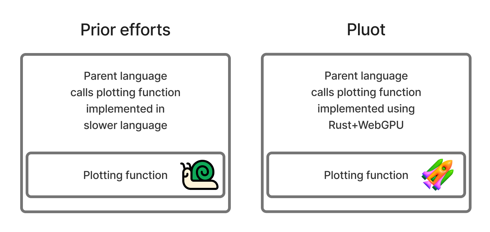

Pluot is an attempt at the lofty goal of 'write once, run everywhere' visualization software.

## Motivations

At its core, this project is motivated by code reuse.
It should be possible to implement a particular data visualization rendering function once, and then reuse the software in multiple contexts: as an interactive plot within a web application, or to generate a publication-quality static figure for a scientific paper.

We should not be satisfied with the status quo in which countless hours are spent building web-based interactive visualization tools, only to use (or build) entirely separate toolkits in Python or R in order to create a static plot.
Until now, achieving code reuse in these situations has required workarounds such as heavyweight browser automation tools or embedded JavaScript runtimes.
The recent technologies of WebAssembly and WebGPU, along with advancements in the Rust ecosystem, make the timing ripe 😉 to address this challenge in a way that avoids such workarounds.

